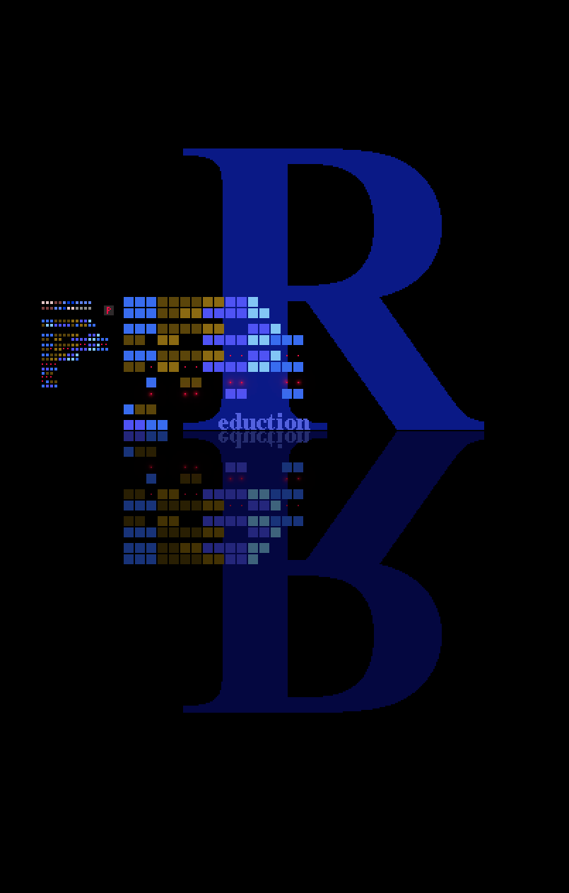

### 本ooks
**Yeah**, dhis is the third problem from *1990*, and the third program
in a row, vhich shows how one shouldn't write programs. (One does
not simply write programs from the scratch!). It's about two readers
called **A** and *B*, a bit of minimalism in action, who have to read
***N*** books with maximum speed:), that is for minimum time. There
is a restriction for the first ***K*** books and other stuff ∪ can
view [here](https://ioinformatics.org/files/ioi1990round1.pdf).
*基undamentally*, ve can think of book time per hour as a cube with
different colours or different names. For example if reading times are
```
A = [3, 5, 2, 1]
B = [4, 2, 1, 3],
```
than ve can think of them as:
```
A = ♣ ♣ ♣ ☰ ☰ ☰ ☰ ☰ ` ` ☂
B = ♣ ♣ ♣ ♣ ☰ ☰ ` ☂ ☂ ☂
```
***想o***, the question is how to shuffle those objects so that the
up and down elements are not the same, with the given restrictions.
ベasically will try to give an explanation in detail (joking:)  of the
program step-by-step and zen run it and see ze oufut. There are lot
of bugs so don't try this at home! ◀ This is a warning.

***以ecause*** the minimum time after which the second book is unlocked
is A[1] + B[1], we build the *shedule* around *locked* books by inserting
alternating waiting slots from the oppositie reader time. If *K=2* for
ze above case, the *expanded lock* or *core shedule* or whatever will be:
```
[1, 1, 1, 0, 0, 0, 0, 2, 2, 2, 2, 2, 0, 0],
[0, 0, 0, 1, 1, 1, 1, 0, 0, 0, 0, 0, 2, 2]
```
If the total reading time of the remaining *free* books for either reader
is less than or equal it's waiting slots that we are don! We can put them
wherever we like. Otherwise we have to look for appropriate arangements.
It's seems like permutations from a multiset best fits the problem but
this algorithm seems quite complex to me, zo I've decided to use the
**Python** *itertools.permutations(range(n), k)* stuff. To limit the
number of variations free books pass through a process of *Reduction* which
can be illustrated by the following picture:



Matched and unmached squares are placed in lists *goal* and *crossbar*
respectively. Than we make a permutation loop search only on the *crossbar*
data. Than after the *maxspeed* arangement is found all books are appended
to the *goal* list. From here we fill the *lock* waiting slots by popping
*goal* elements from the *tail*. Than the desired *shedule* will represent
the *lock* list extended with remaining *goal* entries.

### Okay!
Let's start the program!
```
$ ./books.py
################################################################
reader[a] = [4, 5, 5, 6, 7]
reader[b] = [3, 6, 3, 7, 4]
################################################################
lock[a] = [4, 5]
lock[b] = [3, 6]
free[a] = [5, 6, 7]
free[b] = [3, 7, 4]
################################################################
xp lock:
[1, 1, 1, 1, 0, 0, 0, 2, 2, 2, 2, 2, 0, 0, 0, 0, 0, 0]
[0, 0, 0, 0, 1, 1, 1, 0, 0, 0, 0, 0, 2, 2, 2, 2, 2, 2]
xp free:
[[3, 3, 3, 3, 3], [4, 4, 4, 4, 4, 4], [5, 5, 5, 5, 5, 5, 5]]
[[3, 3, 3], [4, 4, 4, 4, 4, 4, 4], [5, 5, 5, 5]]
cross = 5
################################################################
goal:
[3, 3, 3, 3, 3, 4, 4, 4, 4, 5, 5, 5]
[4, 4, 4, 4, 4, 5, 5, 5, 5, 3, 3, 3]
crossbar:
[4, 4, 5, 5, 5, 5]
[4, 4]
################################################################
maxspeed = [[2, 3], [0, 1]]
shedule:
[1, 1, 1, 1, 5, 5, 4, 2, 2, 2, 2, 2, 4, 5, 5, 5, 5, 5, 3, 3, 3, 3, 3, 4, 4, 4, 4]
[4, 4, 3, 3, 1, 1, 1, 3, 5, 5, 5, 5, 2, 2, 2, 2, 2, 2, 4, 4, 4, 4, 4, 0, 0, 0, 0]
```
https://youtu.be/nhIriLZUXX0